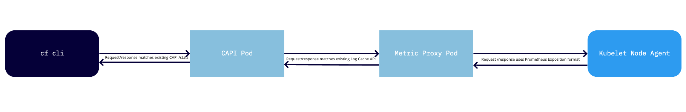

# metric-proxy

The metric-proxy acts as a translation layer for the [log-cache API](https://github.com/cloudfoundry/log-cache) for use
in [cf-for-k8s](https://github.com/cloudfoundry/cf-for-k8s). When a request comes into the metric-proxy the proxy 
will scrape the kubelet of the apropriate Kubernetes pod(s) and format the results to match the existing log-cache API. This ensures developers can get metrics from existing versions of the cf cli when running commands `cf app`, `cf apps` or `cf push`. 

